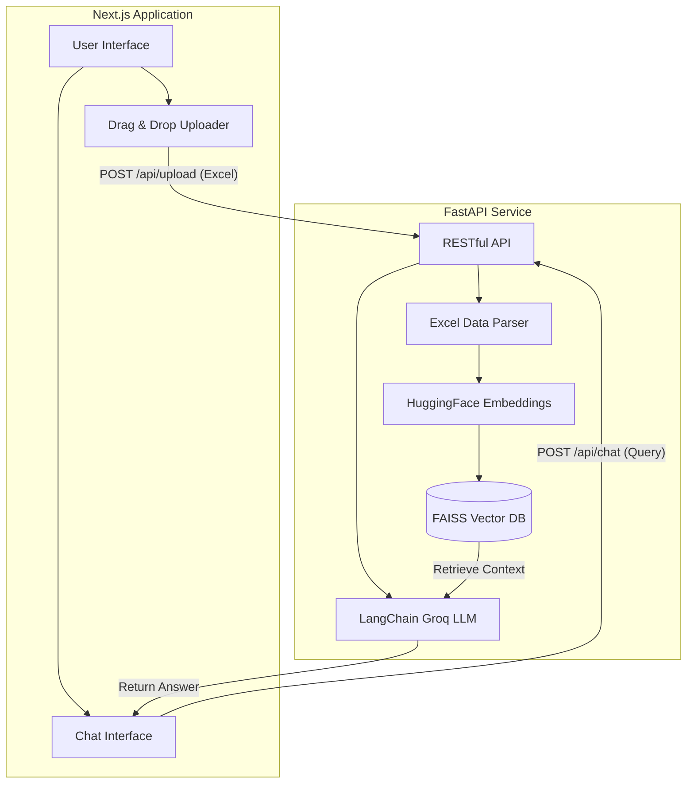

# Project Overview: Excel RAG Application

This document serves as the comprehensive implementation blueprint for the Retrieval-Augmented Generation (RAG) web application. The platform enables users to securely upload Excel spreadsheets and interactively query the data using state-of-the-art NLP models.

## 1. High-Level Architecture

We will adopt a **Full-Stack decouple architecture** featuring a Node-based frontend and a Python-based backend. This ensures we can leverage cutting-edge responsive UI frameworks alongside native Python AI/ML libraries, completely side-stepping Windows C++ build issues for vector indexing.



## 2. Advanced UI/UX Specifications

The frontend will be built to feel incredibly premium, fast, and satisfying to use.

- **Framework**: **Next.js (App Router)** with **TypeScript**, maximizing performance and type safety.
- **Styling**: **Tailwind CSS**, strictly employing utility classes to avoid global CSS bloat.
- **Aesthetics**:
  - **Glassmorphism**: Modals, sidebars, and chat bubbles will utilize `backdrop-blur` and semi-transparent RGBA backgrounds.
  - **Dark Mode First**: Deep, sleek blacks/grays (e.g., `#09090b`) contrasted by electric, vibrant primary colors (e.g., `#6366f1` Indigo).
  - **Typography**: `Inter` or `Geist` fonts for crisp, tech-forward readability.
- **Motion & Interaction**:
  - **Framer Motion**: We will implement staggered fade-in lists for the chat history, spring animations for buttons, and smooth layout transitions when the file upload completes.
  - **Lucide React**: Minimal, beautiful vector icons for user interactions.

## 3. Backend AI & Data Engineering

The backend ensures that uploaded data is ingested securely and queried extremely fast.

- **Data Ingestion**: `pandas` will stream and normalize the uploaded `.xlsx` data into text chunks (rows represented as JSON-like textual structures).
- **Embeddings**: We will harness `sentence-transformers/all-MiniLM-L6-v2` locally. It's lightweight, extremely fast, and highly capable for semantic search.
- **Vector Search**: `faiss-cpu`. FAISS is the industry standard for dense vector similarity search, operating strictly in-memory or saved to disk temporarily.
- **Generative Generation**: We will pipe the user query + retrieved FAISS context into `ChatGroq` (using the `llama3-70b-8192` model) via LangChain to stream or return high-quality answers instantly.

## 4. API Contract

The communication between the frontend and backend will follow these clean RESTful contracts:

### A. Upload Document
- **Endpoint**: `POST http://localhost:8000/upload`
- **Payload**: `multipart/form-data` with key `file`
- **Response**: `{ "status": "success", "filename": "data.xlsx", "rows_processed": 145 }`

### B. Chat Query
- **Endpoint**: `POST http://localhost:8000/chat`
- **Payload**: `{ "query": "What is the total revenue in Q3?", "history": [] }`
- **Response**: `{ "answer": "Based on the provided document, the total revenue in Q3 is $45,000.", "sources": [...] }`

## 5. Security & Environment Configuration

> [!CAUTION]
> As highlighted previously, your GROQ API key must be hydrated for the application to generate responses.

- We will generate a `.env` file in the backend root:
  ```env
  GROQ_API_KEY=your_actual_key_here
  ```
- CORS will be strictly locked down in the FastAPI configuration to only allow Next.js `localhost` origins during development.

## 6. Verification & Rollout Plan

Once you approve this architecture:
1. **Repository Init**: I will generate the `/frontend` Next.js boilerplate and the `/backend` FastAPI environment.
2. **Frontend Wiring**: Implement the advanced UI components and custom Tailwind configurations.
3. **Backend Logic**: Build the Excel parsing pipeline and connect LangChain, HuggingFace, and FAISS.
4. **Integration**: Wire the backend endpoints to the Next.js UI using `fetch` or `axios`.
5. **Testing**: Run dev servers and comprehensively test a sample `.xlsx` upload and query lifecycle.
